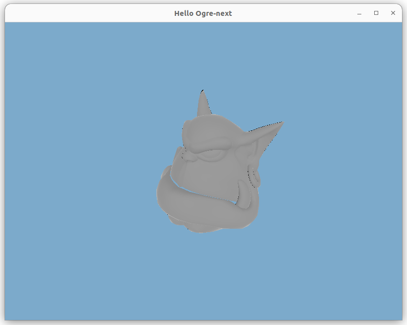

# Hello Ogre-next

Small hello-world application on [Ogre-next](https://github.com/OGRECave/ogre-next) version 2.3.3



### Setup

Requirements:

* Ubuntu 22

Setup script will install:

* Cmake
* Ninja
* Clang 17

```shell
bash ./setup.sh
```

### Useful links

* [Cmake bootstrap](https://github.com/OGRECave/ogre-next/blob/dd50b3d7bbd7601b7101114f9d13856936b0bc7f/Samples/2.0/Tutorials/EmptyProject/CMake/Bootstrap.cmake#L13-L17)
* https://ogrecave.github.io/ogre-next/api/2.3/index.html
* https://macoy.me/code/macoy/ogre-start-project/src/branch/master/main.cpp
* [Switch GL type](https://github.com/iwatake2222/FastGameOfLife/issues/3#issuecomment-975219575)
